# TÀI LIỆU THIẾT KẾ HỆ THỐNG
## WebDoanVien – Hệ Thống Quản Lý Đoàn Viên Thanh Niên CATP

---

| Thông tin | Nội dung |
|---|---|
| **Tên dự án** | youth-union-management |
| **Phiên bản tài liệu** | 1.0 |
| **Ngày soạn** | Tháng 9, 2026 |
| **Loại tài liệu** | System Design Document (SDD) |

---

## MỤC LỤC

1. [Giới thiệu & Bối cảnh](#1-giới-thiệu--bối-cảnh)
2. [Stakeholders & Actors](#2-stakeholders--actors)
3. [Use Case Diagram](#3-use-case-diagram)
4. [Mô tả Use Case chi tiết](#4-mô-tả-use-case-chi-tiết)
5. [User Stories & Acceptance Criteria](#5-user-stories--acceptance-criteria)
6. [Activity Diagrams – Luồng nghiệp vụ](#6-activity-diagrams--luồng-nghiệp-vụ)
7. [Sequence Diagrams](#7-sequence-diagrams)
8. [Entity Relationship Diagram (ERD)](#8-entity-relationship-diagram-erd)
9. [Kiến trúc hệ thống & Phân quyền](#9-kiến-trúc-hệ-thống--phân-quyền)
10. [Non-Functional Requirements](#10-non-functional-requirements)
11. [Bảng chú giải thuật ngữ](#11-bảng-chú-giải-thuật-ngữ)

---

## 1. Giới thiệu & Bối cảnh

### 1.1. Mục tiêu tài liệu

Tài liệu này mô tả thiết kế nghiệp vụ và hệ thống của **WebDoanVien Backend** — nền tảng API phục vụ số hóa toàn bộ hoạt động quản lý đoàn viên của **Ban Thanh niên Cảnh sát Thành phố (CATP)**. Tài liệu hướng đến các đối tượng: HR, Quản lý dự án, Nhà phát triển và các bên liên quan muốn hiểu toàn diện về hệ thống.

### 1.2. Vấn đề nghiệp vụ (Problem Statement)

Trước khi hệ thống được xây dựng, tổ chức Đoàn CATP đang đối mặt với các vấn đề:

| Vấn đề | Tác động |
|---|---|
| Hồ sơ đoàn viên quản lý bằng file Excel thủ công | Dễ mất mát, không nhất quán, khó tra cứu |
| Phê duyệt chuyển sinh hoạt qua giấy tờ | Chậm trễ, thiếu audit trail |
| Không có cơ chế kiểm soát quyền truy cập dữ liệu | Cán bộ cơ sở A có thể xem dữ liệu cơ sở B |
| Điểm danh hoạt động bằng danh sách giấy | Dễ gian lận, tốn thời gian tổng hợp |
| Không có kênh thu thập ý kiến đoàn viên | Thiếu cơ chế phản hồi từ cơ sở |

### 1.3. Phạm vi hệ thống (System Scope)

Hệ thống WebDoanVien quản lý toàn bộ vòng đời nghiệp vụ đoàn viên:

```
KẾT NẠP → QUẢN LÝ HỒ SƠ → HOẠT ĐỘNG → ĐÁNH GIÁ → CHUYỂN SINH HOẠT / XUẤT ĐOÀN
```

### 1.4. Cấu trúc tổ chức

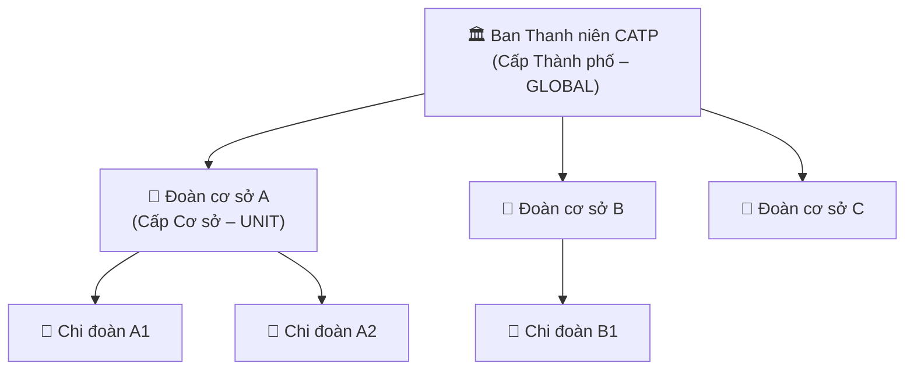

---

## 2. Stakeholders & Actors

### 2.1. Bảng Stakeholders

| Stakeholder | Vai trò | Kỳ vọng |
|---|---|---|
| **Ban Thanh niên CATP** | Sponsor & GLOBAL Admin | Dashboard tổng quan, kiểm soát toàn bộ hệ thống |
| **Bí thư Đoàn cơ sở** | Quản lý cấp cơ sở | Quản lý đoàn viên, tổ chức hoạt động, duyệt ý tưởng |
| **Cán bộ BCH** | Người dùng cán bộ | Giao việc, đánh giá xếp loại, xem báo cáo |
| **Đoàn viên** | End user | Xem thông tin cá nhân, tham gia hoạt động, gửi ý tưởng |
| **ICIB Lab – SGU** | Đội phát triển | Xây dựng và bảo trì hệ thống |

### 2.2. Danh sách Actors

| Actor | Mô tả | Scope |
|---|---|---|
| **`GLOBAL_ADMIN`** | Cán bộ Ban TN CATP, toàn quyền | Toàn bộ hệ thống |
| **`UNIT_SECRETARY`** | Bí thư Chi đoàn cơ sở | Phạm vi đơn vị + chi đoàn con |
| **`UNIT_OFFICER`** | Cán bộ BCH đơn vị | Phạm vi đơn vị được giao |
| **`MEMBER`** | Đoàn viên thông thường | Chỉ dữ liệu cá nhân |
| **`SYSTEM`** | Hệ thống tự động | Cron jobs, QR validation |

---

## 3. Use Case Diagram

### 3.1. Tổng quan Use Case toàn hệ thống

```mermaid
graph LR
    MEMBER(("👤 Đoàn viên"))
    OFFICER(("👔 Cán bộ BCH"))
    SECRETARY(("🔑 Bí thư"))
    ADMIN(("🛡️ GLOBAL Admin"))

    subgraph AUTH["🔐 Xác thực"]
        UC1["Đăng nhập"]
        UC2["Đăng xuất"]
        UC3["Làm mới Token"]
    end

    subgraph MEMBER_MGT["👥 Quản lý Đoàn viên"]
        UC4["Xem hồ sơ cá nhân"]
        UC5["Cập nhật hồ sơ"]
        UC6["Tạo hồ sơ đoàn viên"]
        UC7["Xuất danh sách Excel/PDF"]
        UC8["Xem lịch sử chuyển SHĐ"]
    end

    subgraph DECISION["📋 Quyết định"]
        UC9["Tạo quyết định"]
        UC10["Phê duyệt quyết định"]
        UC11["Từ chối quyết định"]
        UC12["Xem timeline quyết định"]
    end

    subgraph ACTIVITY["🎯 Hoạt động"]
        UC13["Tạo hoạt động"]
        UC14["Sinh mã QR điểm danh"]
        UC15["Quét QR điểm danh"]
        UC16["Xem danh sách người tham gia"]
        UC17["Chốt kết quả hoạt động"]
    end

    subgraph TASK["📌 Giao việc"]
        UC18["Tạo nhiệm vụ"]
        UC19["Gán người thực hiện"]
        UC20["Cập nhật tiến độ"]
        UC21["Đánh giá kết quả"]
    end

    subgraph IDEA["💡 Hộp thư ý tưởng"]
        UC22["Gửi ý tưởng"]
        UC23["Chỉnh sửa ý tưởng"]
        UC24["Duyệt ý tưởng Vòng 1"]
        UC25["Duyệt ý tưởng Vòng 2"]
        UC26["Xem danh sách ý tưởng"]
    end

    subgraph EVAL["📊 Đánh giá xếp loại"]
        UC27["Tạo đánh giá xếp loại"]
        UC28["Xem thống kê xếp loại"]
    end

    subgraph REPORT["📈 Báo cáo"]
        UC29["Xem Dashboard tổng quan"]
        UC30["Xem thống kê theo đơn vị"]
    end

    MEMBER --> UC1
    MEMBER --> UC2
    MEMBER --> UC4
    MEMBER --> UC15
    MEMBER --> UC22
    MEMBER --> UC23
    MEMBER --> UC26

    OFFICER --> UC1
    OFFICER --> UC5
    OFFICER --> UC6
    OFFICER --> UC7
    OFFICER --> UC8
    OFFICER --> UC9
    OFFICER --> UC10
    OFFICER --> UC11
    OFFICER --> UC12
    OFFICER --> UC13
    OFFICER --> UC16
    OFFICER --> UC18
    OFFICER --> UC19
    OFFICER --> UC20
    OFFICER --> UC21
    OFFICER --> UC24
    OFFICER --> UC27
    OFFICER --> UC28

    SECRETARY --> UC10
    SECRETARY --> UC11
    SECRETARY --> UC14
    SECRETARY --> UC17
    SECRETARY --> UC24
    SECRETARY --> UC30

    ADMIN --> UC25
    ADMIN --> UC29
    ADMIN --> UC30
    ADMIN --> UC7
```

---

## 4. Mô tả Use Case chi tiết

### UC-01: Đăng nhập hệ thống

| Thuộc tính | Nội dung |
|---|---|
| **ID** | UC-01 |
| **Tên** | Đăng nhập hệ thống |
| **Actor** | Tất cả người dùng |
| **Tiền điều kiện** | Tài khoản đã được tạo, trạng thái ACTIVE |
| **Luồng chính** | 1. Người dùng nhập `username` + `password` → 2. Hệ thống xác thực → 3. Cấp JWT Access Token + Refresh Token qua HttpOnly Cookie → 4. Redirect về trang chủ |
| **Luồng thay thế** | Sai mật khẩu → Thông báo lỗi 401; Tài khoản bị khóa → Thông báo 403 kèm thời gian mở khóa |
| **Hậu điều kiện** | Người dùng đã xác thực, token hợp lệ trong session |

---

### UC-10: Phê duyệt quyết định đoàn viên

| Thuộc tính | Nội dung |
|---|---|
| **ID** | UC-10 |
| **Tên** | Phê duyệt quyết định |
| **Actor** | Cán bộ BCH, Bí thư, GLOBAL Admin |
| **Tiền điều kiện** | Quyết định ở trạng thái `PENDING`; Actor thuộc đơn vị liên quan |
| **Luồng chính** | 1. Actor xem danh sách quyết định đang chờ → 2. Chọn quyết định cần duyệt → 3. Xem nội dung chi tiết → 4. Nhấn "Phê duyệt" → 5. Hệ thống ghi nhận APPROVED + lưu audit log → 6. Nếu là quyết định Chuyển SHĐ → Hệ thống tự động cập nhật `member.unionUnit` |
| **Luồng thay thế** | Actor không thuộc đơn vị → 403 Forbidden; Quyết định đã được duyệt → Không cho phép |
| **Quy tắc nghiệp vụ** | Quyết định chuyển SHĐ: chỉ cơ sở chuyển đi HOẶC cơ sở tiếp nhận mới có quyền duyệt |
| **Hậu điều kiện** | Quyết định ở trạng thái `APPROVED`; Lịch sử đơn vị được tạo tự động |

---

### UC-15: Quét mã QR điểm danh

| Thuộc tính | Nội dung |
|---|---|
| **ID** | UC-15 |
| **Tên** | Điểm danh hoạt động qua QR |
| **Actor** | Đoàn viên |
| **Tiền điều kiện** | Hoạt động đang ở trạng thái `PUBLISHED`; Mã QR còn hiệu lực |
| **Luồng chính** | 1. Đoàn viên mở app → Quét QR → 2. Frontend gửi `token` lên API `/api/checkin` → 3. Hệ thống giải mã payload → 4. Xác thực token hợp lệ, chưa hết hạn → 5. Ghi nhận `ActivityParticipant` → 6. Trả về thành công |
| **Luồng thay thế** | Token hết hạn → Thông báo "Mã QR đã hết hạn"; Đã điểm danh → Thông báo "Bạn đã điểm danh rồi" |
| **Hậu điều kiện** | Đoàn viên được ghi nhận tham gia hoạt động |

---

### UC-24 & UC-25: Phê duyệt ý tưởng (2 vòng)

| Thuộc tính | UC-24 (Vòng 1) | UC-25 (Vòng 2) |
|---|---|---|
| **Actor** | Bí thư Chi đoàn cơ sở | Cán bộ Ban TN CATP (GLOBAL) |
| **Điều kiện** | Ý tưởng ở `PENDING_UNIT_APPROVAL` | Ý tưởng ở `PENDING_CITY_APPROVAL` |
| **Kết quả Phê duyệt** | Chuyển sang `PENDING_CITY_APPROVAL` | Ý tưởng được `APPROVED` ✓ |
| **Kết quả Từ chối** | `REJECTED` (bắt buộc nhập lý do) | `REJECTED` (bắt buộc nhập lý do) |
| **Ràng buộc** | Không tự duyệt ý tưởng bản thân; Bí thư phải cùng đơn vị với người gửi | Chỉ cán bộ GLOBAL (không có giới hạn đơn vị) |

---

## 5. User Stories & Acceptance Criteria

### US-01: Quản lý hồ sơ đoàn viên

> **Là** Cán bộ BCH,  
> **Tôi muốn** tìm kiếm và xem hồ sơ đoàn viên trong đơn vị của tôi,  
> **Để** nắm bắt thông tin và hỗ trợ các thủ tục hành chính.

**Acceptance Criteria:**
- [ ] Tìm kiếm được theo tên, CCCD, số thẻ đoàn viên
- [ ] Lọc được theo đơn vị, trạng thái (ACTIVE/SUSPENDED), giới tính
- [ ] Kết quả phân trang (mặc định 10/trang)
- [ ] **Chỉ hiển thị đoàn viên thuộc phạm vi đơn vị của cán bộ đăng nhập** ← Yêu cầu bảo mật cốt lõi
- [ ] Không hiển thị đoàn viên đã bị xóa mềm (`deleted_at IS NOT NULL`)

---

### US-02: Gửi và theo dõi ý tưởng

> **Là** Đoàn viên,  
> **Tôi muốn** gửi ý tưởng/sáng kiến và theo dõi quá trình phê duyệt,  
> **Để** đóng góp vào hoạt động phong trào của đơn vị.

**Acceptance Criteria:**
- [ ] Đoàn viên điền tiêu đề, mô tả và đính kèm tệp (tùy chọn)
- [ ] Sau khi gửi, ý tưởng ở trạng thái `PENDING_UNIT_APPROVAL`
- [ ] Đoàn viên xem được danh sách ý tưởng của bản thân qua `/api/ideas/my-ideas`
- [ ] Xem được trạng thái hiện tại và lịch sử các lượt phê duyệt
- [ ] **Không thể tự phê duyệt ý tưởng của chính mình**
- [ ] Được thông báo khi ý tưởng được phê duyệt/từ chối/yêu cầu chỉnh sửa

---

### US-03: Tổ chức hoạt động và điểm danh QR

> **Là** Bí thư Chi đoàn,  
> **Tôi muốn** tạo hoạt động và điểm danh đoàn viên tự động qua QR,  
> **Để** tiết kiệm thời gian và có dữ liệu tham gia chính xác.

**Acceptance Criteria:**
- [ ] Tạo hoạt động với thông tin: tên, loại, thời gian, địa điểm, người phụ trách
- [ ] Sinh mã QR duy nhất cho từng hoạt động (payload được mã hóa)
- [ ] Đoàn viên quét QR → hệ thống ghi nhận tức thì (không cần thao tác thủ công)
- [ ] Chặn điểm danh trùng lặp cho cùng một đoàn viên trong một hoạt động
- [ ] Xem được danh sách người đã điểm danh theo thời gian thực
- [ ] Sau khi chốt (`is_finalized = true`), không cho phép điểm danh thêm

---

### US-04: Xuất báo cáo danh sách đoàn viên

> **Là** Cán bộ BCH / GLOBAL Admin,  
> **Tôi muốn** xuất danh sách đoàn viên ra file Excel hoặc PDF,  
> **Để** phục vụ báo cáo định kỳ lên cấp trên.

**Acceptance Criteria:**
- [ ] Lọc theo đơn vị, trạng thái, từ khóa trước khi xuất
- [ ] **File xuất ra chỉ chứa dữ liệu trong phạm vi quyền hạn của người xuất**
- [ ] File Excel (.xlsx) đúng định dạng báo cáo, có header đầy đủ
- [ ] File PDF có logo, ngày xuất và tổng số bản ghi
- [ ] Thời gian tạo file ≤ 5 giây với tối đa 1.000 bản ghi

---

### US-05: Đánh giá xếp loại định kỳ

> **Là** Cán bộ BCH,  
> **Tôi muốn** đánh giá xếp loại đoàn viên theo quý/năm,  
> **Để** có cơ sở xét khen thưởng và theo dõi tiến bộ của đoàn viên.

**Acceptance Criteria:**
- [ ] Chọn đoàn viên, kỳ đánh giá (quý/năm), kết quả xếp loại và ghi chú
- [ ] Hệ thống ngăn chặn việc đánh giá đoàn viên không thuộc đơn vị của cán bộ
- [ ] Hỗ trợ tạo phiên bản chỉnh sửa (`EvaluationRevision`) khi cần cập nhật
- [ ] Dashboard hiển thị thống kê 4 card: Xuất sắc / Tốt / Khá / Trung bình
- [ ] Xem được lịch sử đánh giá qua các kỳ của từng đoàn viên

---

## 6. Activity Diagrams – Luồng nghiệp vụ

### 6.1. Luồng phê duyệt Ý tưởng (2 vòng)

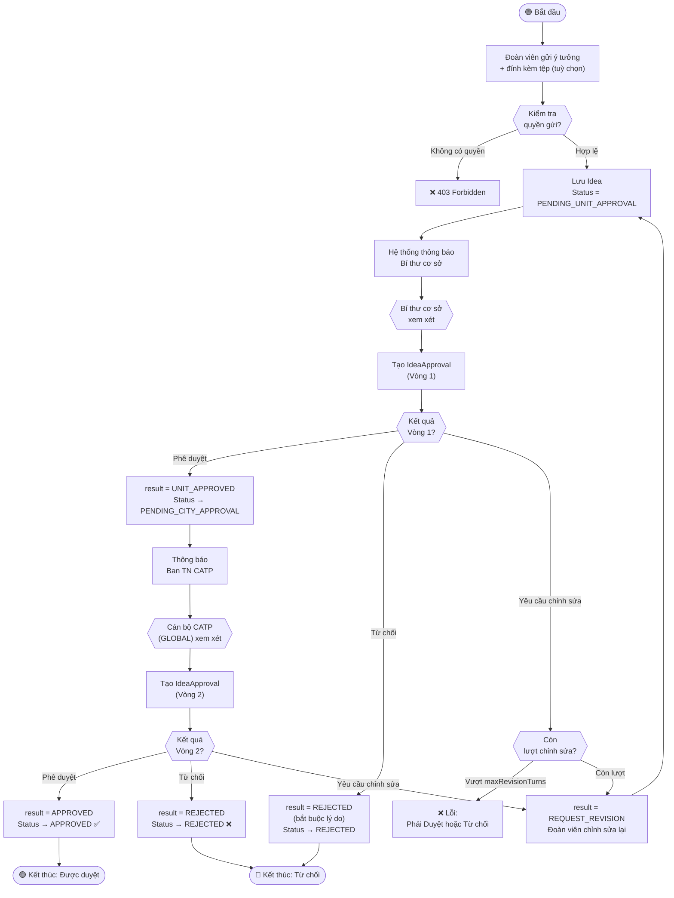

---

### 6.2. Luồng phê duyệt Quyết định Chuyển sinh hoạt Đoàn

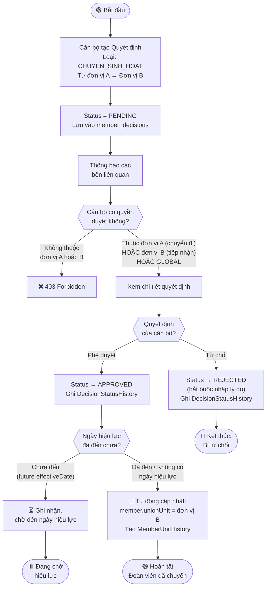

---

### 6.3. Luồng điểm danh QR Code

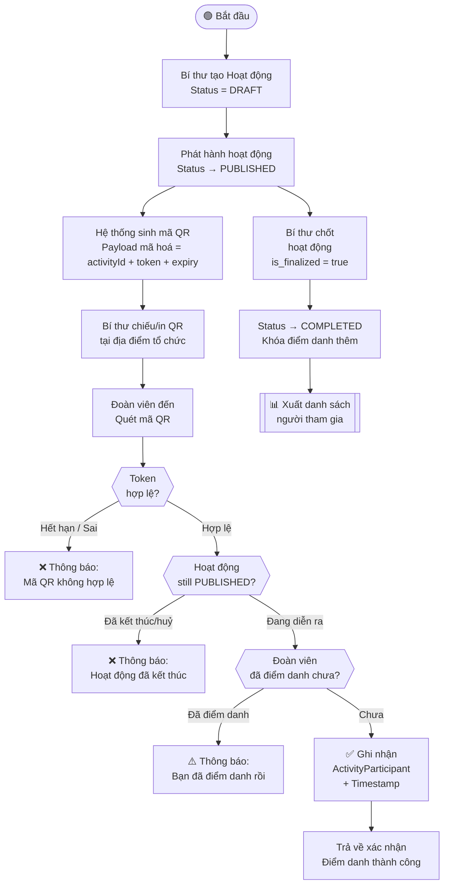

---

### 6.4. Luồng Giao việc & Theo dõi nhiệm vụ

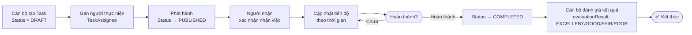

---

## 7. Sequence Diagrams

### 7.1. Luồng Đăng nhập – Refresh Token

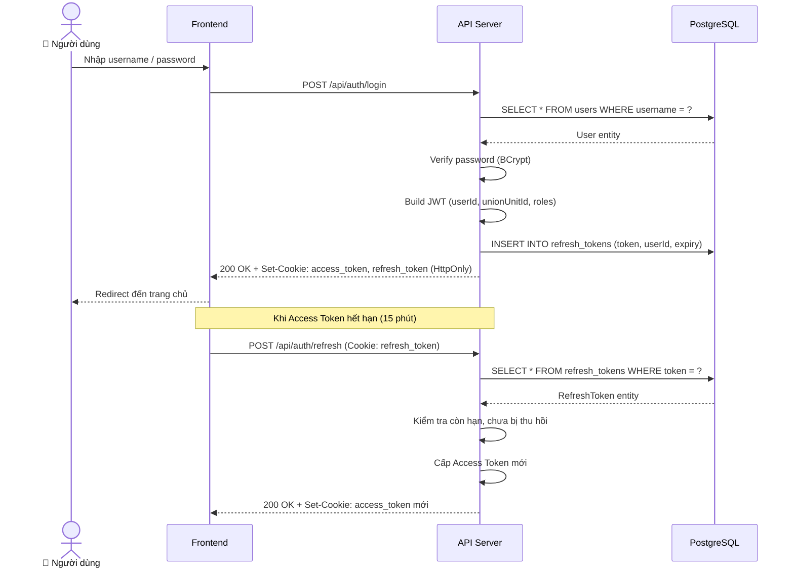

---

### 7.2. Luồng API bảo vệ bởi phân quyền 2 tầng

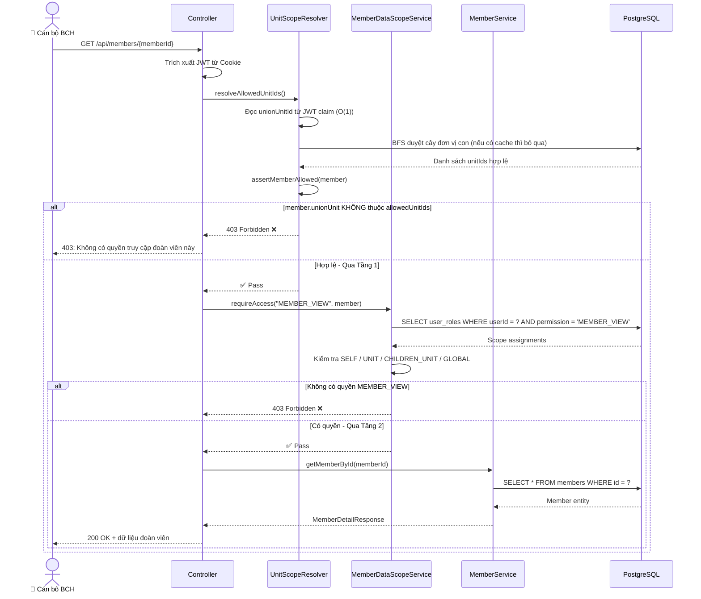

---

### 7.3. Luồng Phê duyệt Ý tưởng Vòng 1

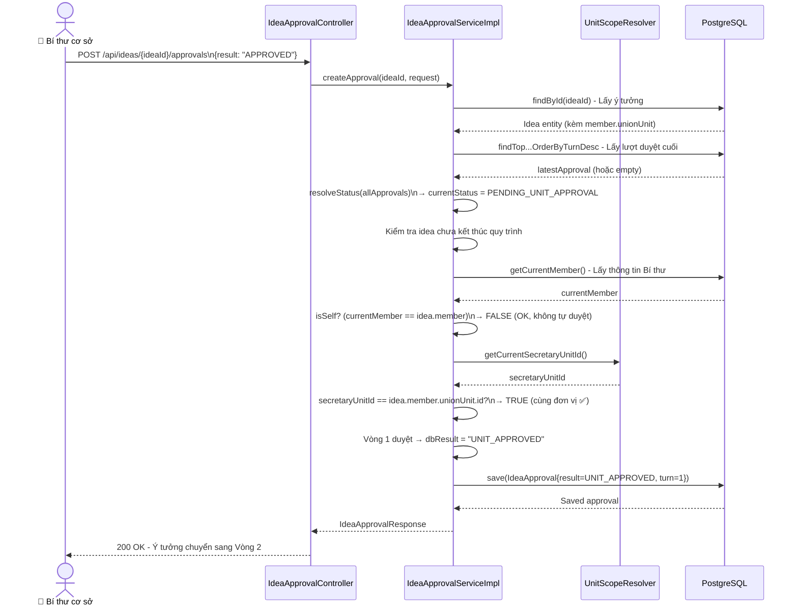

---

## 8. Entity Relationship Diagram (ERD)

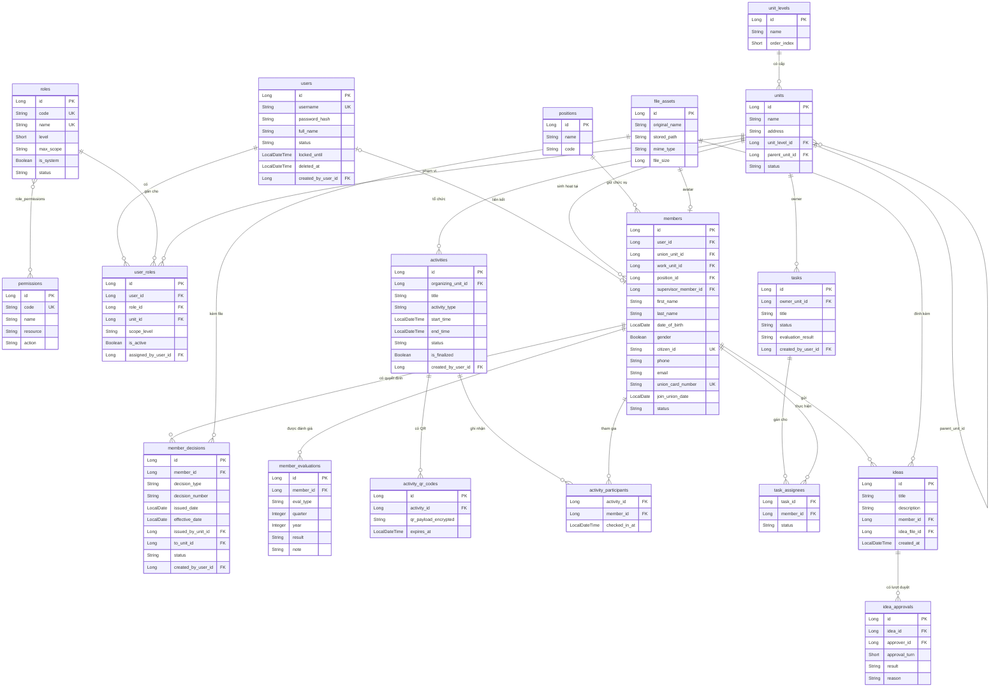

---

## 9. Kiến trúc hệ thống & Phân quyền

### 9.1. Kiến trúc tổng thể

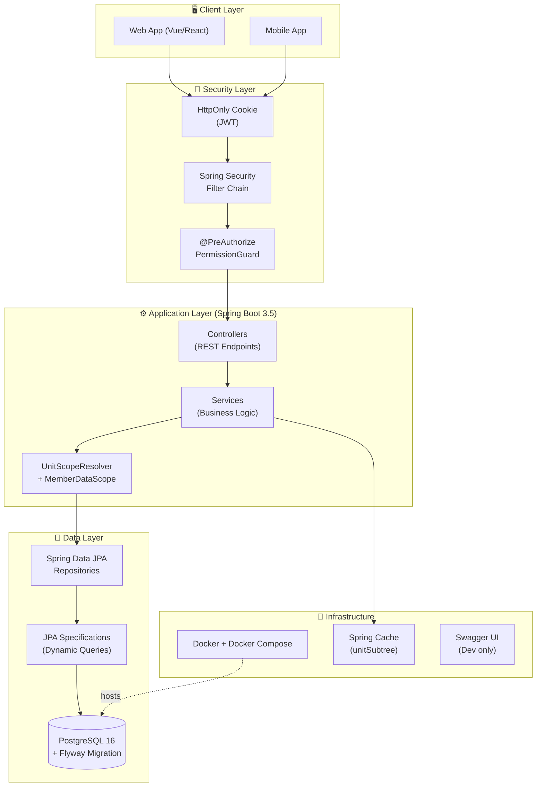

---

### 9.2. Mô hình phân quyền dữ liệu

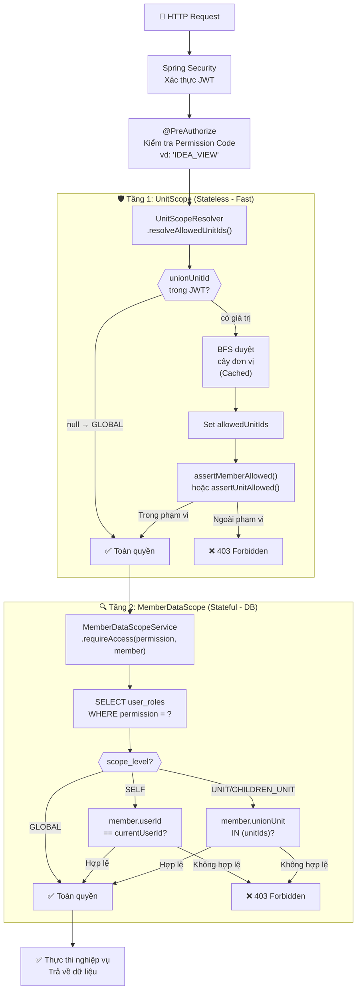

---

## 10. Non-Functional Requirements

### 10.1. Bảo mật (Security)

| Yêu cầu | Mô tả | Hiện trạng |
|---|---|---|
| **Authentication** | JWT lưu trong HttpOnly Cookie (không thể đọc từ JS) | ✅ Đã implement |
| **Authorization** | RBAC với Scope level (SELF/UNIT/CHILDREN_UNIT/GLOBAL) | ✅ Đã implement |
| **Data Isolation** | Cô lập dữ liệu tuyệt đối giữa các đơn vị | ✅ 2-layer security |
| **Audit Trail** | Ghi nhận người tạo/sửa + timestamp mọi thao tác | ✅ Toàn hệ thống |
| **Soft Delete** | Không xóa vật lý, dữ liệu luôn được preserved | ✅ Toàn hệ thống |
| **CCCD Protection** | Xử lý số CCCD theo quy định bảo mật dữ liệu cá nhân | ✅ Có audit report riêng |

### 10.2. Hiệu năng (Performance)

| Yêu cầu | Mục tiêu | Giải pháp |
|---|---|---|
| **API response time** | ≤ 300ms cho các API danh sách thông thường | JPA Specification + Index |
| **Security check** | O(1) cho UnitScope từ JWT | Không cần DB query |
| **Tree traversal** | Cache kết quả BFS cây đơn vị | `@Cacheable("unitSubtree")` |
| **File export** | ≤ 5 giây cho 1.000 bản ghi | Apache POI + streaming |

### 10.3. Độ sẵn sàng & Triển khai (Availability & Deployment)

| Yêu cầu | Mô tả |
|---|---|
| **Containerization** | Docker + Docker Compose, không phụ thuộc môi trường cục bộ |
| **Database Migration** | Flyway tự động, không cần chạy script thủ công |
| **Multi-profile** | `dev` / `test` / `prod` cho từng môi trường |
| **Health Check** | `/actuator/health` cho load balancer monitoring |
| **API Documentation** | Swagger UI tự động từ code (Springdoc OpenAPI) |

### 10.4. Khả năng mở rộng (Scalability)

| Yêu cầu | Mô tả |
|---|---|
| **Modular Architecture** | Thêm module mới (vd: `notification`) không ảnh hưởng module cũ |
| **Stateless API** | Mỗi request tự chứa thông tin xác thực → Dễ horizontal scaling |
| **Generic Specification** | `UnitScopeSpecification` dùng chung cho mọi module mới |

---

## 11. Bảng chú giải thuật ngữ

| Thuật ngữ | Giải thích |
|---|---|
| **CATP** | Cảnh sát Thành phố |
| **BCH** | Ban Chấp hành |
| **SHĐ** | Sinh hoạt Đoàn |
| **GLOBAL** | Phạm vi toàn hệ thống (không giới hạn đơn vị) |
| **UNIT** | Phạm vi một đơn vị cụ thể |
| **CHILDREN_UNIT** | Phạm vi đơn vị và toàn bộ chi đoàn con trực thuộc |
| **SELF** | Chỉ phạm vi dữ liệu cá nhân của người dùng đó |
| **BFS** | Breadth-First Search – thuật toán duyệt cây theo chiều rộng |
| **JWT** | JSON Web Token – chuỗi xác thực stateless |
| **HttpOnly Cookie** | Cookie không thể đọc bởi JavaScript, chống XSS |
| **Soft Delete** | Xóa mềm – đánh dấu `deleted_at` thay vì xóa khỏi DB |
| **Audit Trail** | Nhật ký theo dõi mọi thay đổi trong hệ thống |
| **JPA Specification** | Kỹ thuật tạo câu query động trong Spring Data JPA |
| **RBAC** | Role-Based Access Control – phân quyền theo vai trò |
| **Flyway** | Công cụ quản lý phiên bản schema database |
| **Modular Monolith** | Kiến trúc một ứng dụng nhưng chia thành các module độc lập |

---

*Tài liệu này được tổng hợp và soạn thảo dựa trên phân tích mã nguồn thực tế của dự án WebDoanVien Backend.*  
*Mọi sơ đồ trong tài liệu sử dụng ký pháp Mermaid, có thể render trực tiếp trên GitHub, Notion, Confluence.*

